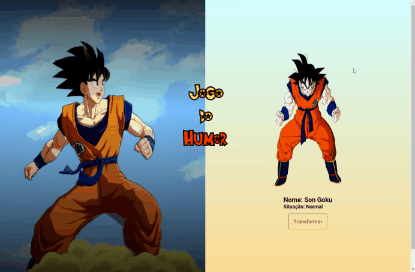

# Projetos Blue Edtech - Módulo 02

Projetos desenvolvidos durante o curso de FullStack.
Usando as tecnologias: HTML, CSS, JAVASCRIPT e NodeJS Express.

---
* [Projeto 01 - Jogo do Humor](#id01)

--- 

- **Projeto 01 - Jogo do Humor - Dragon Ball** 

[Meu código](https://github.com/Thais-Mont/projetos-blue-edtech-mod02)

Aprendizados:

* *Uso de ***ARRAY'S*** e estrutura de repetição com ***FOR*** para acesso
e troca de imagens *.

--- 
